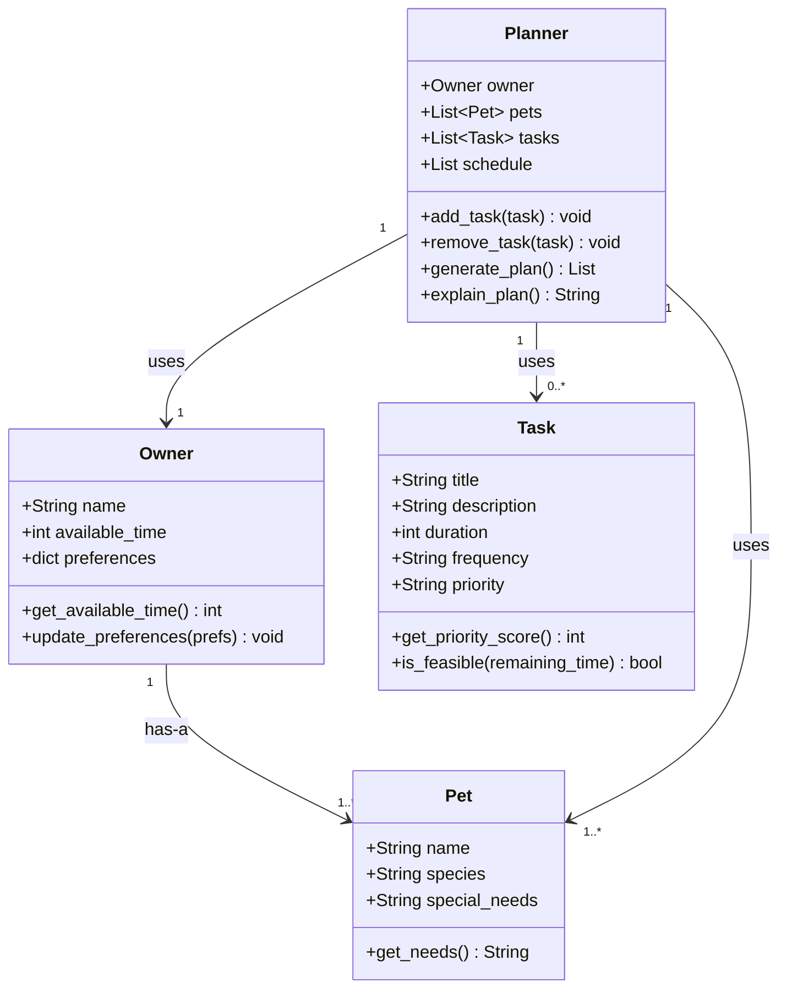

# PawPal+ Class Diagram

```mermaid
classDiagram
    class Owner {
        +String name
        +int available_time
        +dict preferences
        +get_available_time() int
        +update_preferences(prefs) void
    }

    class Pet {
        +String name
        +String species
        +String special_needs
        +get_needs() String
    }

    class Task {
        +String title
        +String description
        +int duration
        +String frequency
        +String priority
        +get_priority_score() int
        +is_feasible(remaining_time) bool
    }

    class Planner {
        +Owner owner
        +List~Pet~ pets
        +List~Task~ tasks
        +List schedule
        +add_task(task) void
        +remove_task(task) void
        +generate_plan() List
        +explain_plan() String
    }

    Owner "1" --> "1..*" Pet : has-a
    Planner "1" --> "1" Owner : uses
    Planner "1" --> "1..*" Pet : uses
    Planner "1" --> "0..*" Task : uses
```
