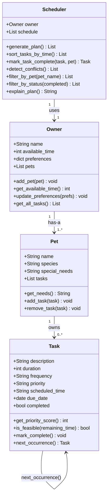

```mermaid
classDiagram
    class Task {
        +String description
        +int duration
        +String frequency
        +String priority
        +String scheduled_time
        +date due_date
        +bool completed
        +get_priority_score() int
        +is_feasible(remaining_time) bool
        +mark_complete() void
        +next_occurrence() Task
    }

    class Pet {
        +String name
        +String species
        +String special_needs
        +List tasks
        +get_needs() String
        +add_task(task) void
        +remove_task(task) void
    }

    class Owner {
        +String name
        +int available_time
        +dict preferences
        +List pets
        +add_pet(pet) void
        +get_available_time() int
        +update_preferences(prefs) void
        +get_all_tasks() List
    }

    class Scheduler {
        +Owner owner
        +List schedule
        +generate_plan() List
        +sort_tasks_by_time() List
        +mark_task_complete(task, pet) Task
        +detect_conflicts() List
        +filter_by_pet(pet_name) List
        +filter_by_status(completed) List
        +explain_plan() String
    }

    Owner "1" --> "1..*" Pet : has-a
    Pet "1" --> "0..*" Task : owns
    Scheduler "1" --> "1" Owner : uses
    Task --> Task : next_occurrence()
```
